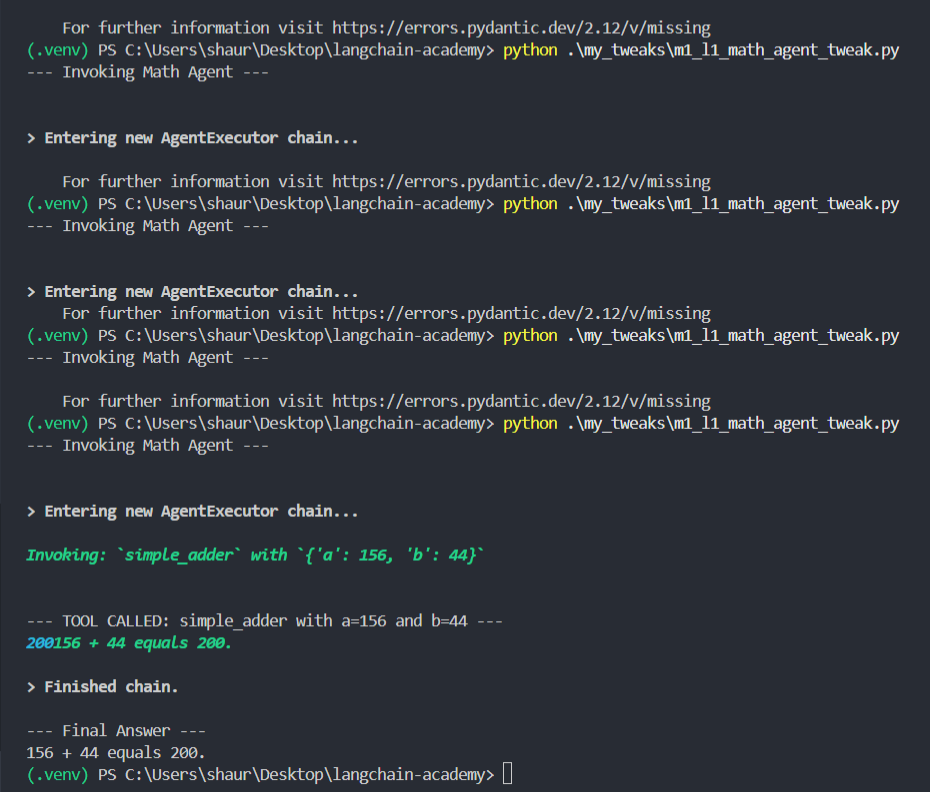
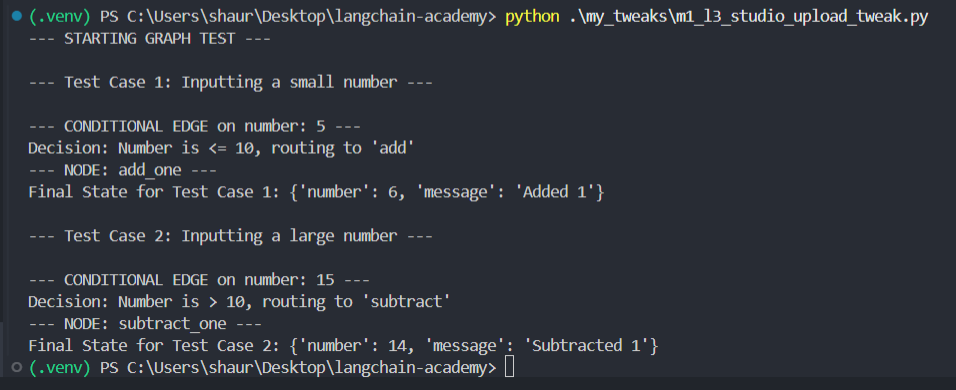
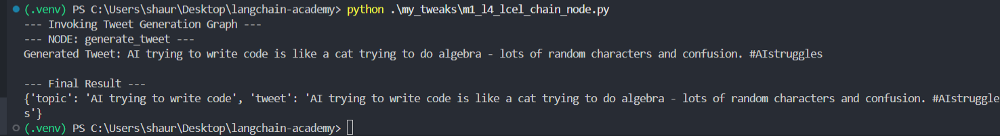
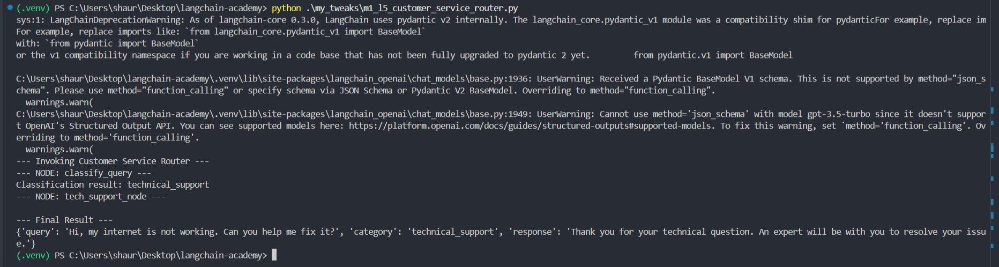
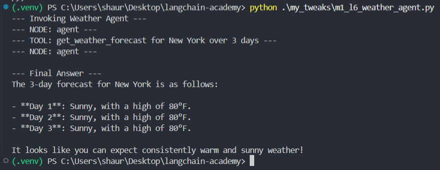

# Shaurya Mittal Nair's LangGraph Course Submission

This repository contains my code tweaks and progress for the "Intro to LangGraph" course. All tweaks are stored in the `my_tweaks` folder, and this document tracks the learning and modifications for each lesson.

---

## Video-by-Video Learning and Tweaks

### Module 1, Lesson 1: Motivation
- **Learned:** Understood that traditional agent executors operate in a single, often brittle loop. LangGraph is motivated by the need to add more control, cycles, and stateful logic to create robust and predictable agentic systems.
- **My Tweak:** Instead of a search agent, I created a simple 'Math Agent' using the modern tool-calling agent structure. This demonstrates the basic components (tool, prompt, LLM, executor) that LangGraph will orchestrate in more complex ways.
- **Source File:** [my_tweaks/m1_l1_math_agent_tweak.py](my_tweaks/m1_l1_math_agent_tweak.py)

### Module 1, Lesson 2: Simple Graph
- **Learned:** Understood the core components of LangGraph: defining a state object (`TypedDict`), creating nodes (functions that modify the state), and connecting them with edges (`add_edge`) to create a simple, directed workflow from a START to an END node.- **My Tweak:** I created a simple, linear graph that performs a sequence of math operations. The graph starts with a number, passes it to an 'add' node, then to a 'subtract' node, demonstrating the flow of state through the graph.
- **Source File:** [my_tweaks/m1_l2_simple_math_graph.py](my_tweaks/m1_l2_simple_math_graph.py)

### Module 1, Lesson 3: LangSmith Studio
- **Learned:** Understood how to package a LangGraph agent into a self-contained Python file and test its logic. This is the foundation for deploying agents either locally or in the cloud.
- **My Tweak:** I created a conditional math agent and tested both of its logical paths by invoking the graph directly within the script. The output confirms that the graph correctly routes the state based on the input.
- **Source File:** [my_tweaks/m1_l3_studio_upload_tweak.py](my_tweaks/m1_l3_studio_upload_tweak.py)

### Module 1, Lesson 4: Chain
- **Learned:** Understood how to wrap a standard LangChain Expression Language (LCEL) chain into a single, callable node within a LangGraph. This allows for complex, multi-step logic to be encapsulated cleanly inside one part of the graph.
- **My Tweak:** I created an LCEL chain that generates a funny tweet. This entire chain was then used as the function for a single node in a simple LangGraph, demonstrating how to integrate existing LangChain components.
- **Source File:** [my_tweaks/m1_l4_lcel_chain_node.py](my_tweaks/m1_l4_lcel_chain_node.py)

### Module 1, Lesson 5: Router
- **Learned:** Understood how to create a router, which is a conditional edge that uses an LLM to decide the next step in the graph. By using an LLM with structured output, we can create reliable and flexible routing logic.
- **My Tweak:** I built a Customer Service Agent that uses an LLM-based router to classify a user's query. The graph routes the query to a specialized node for billing, technical support, or general inquiries, providing a tailored response.
- **Source File:** [my_tweaks/m1_l5_customer_service_router.py](my_tweaks/m1_l5_customer_service_router.py)

### Module 1, Lesson 6: Agent
- **Learned:** Understood how to construct a complete, cyclical agent by combining a reasoning node (the agent), a tool execution node, and a conditional edge. This structure allows the agent to loop, calling tools as many times as needed to gather information before generating a final response.
- **My Tweak:** I built a Weather Agent with two distinct tools for current and forecast weather. The agent correctly routes the user's question, calls the appropriate tool, and then uses the tool's output to formulate a complete answer.
- **Source File:** [my_tweaks/m1_l6_weather_agent.py](my_tweaks/m1_l6_weather_agent.py)

