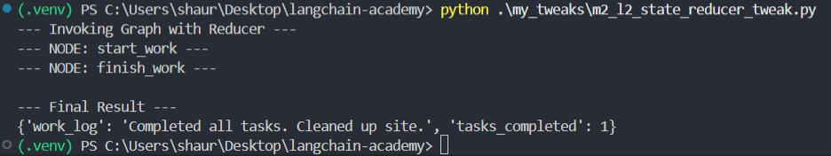
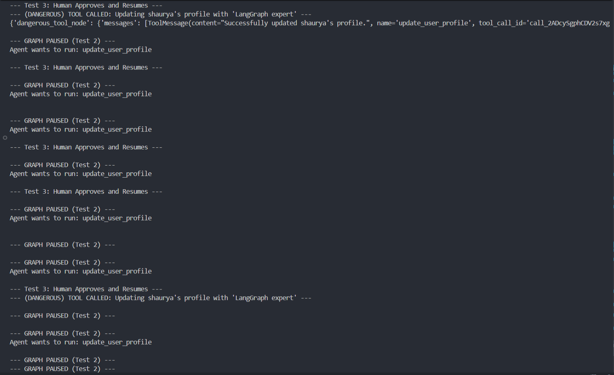

# Shaurya Mittal Nair's LangGraph Course Submission

This repository contains my code tweaks and progress for the "Intro to LangGraph" course. All tweaks are stored in the `my_tweaks` folder, and this document tracks the learning and modifications for each lesson.

---

## Video-by-Video Learning and Tweaks

### Module 1, Lesson 1: Motivation
- **Learned:** Understood that traditional agent executors operate in a single, often brittle loop. LangGraph is motivated by the need to add more control, cycles, and stateful logic to create robust and predictable agentic systems.
- **My Tweak:** Instead of a search agent, I created a simple 'Math Agent' using the modern tool-calling agent structure. This demonstrates the basic components (tool, prompt, LLM, executor) that LangGraph will orchestrate in more complex ways.
- **Source File:** [my_tweaks/m1_l1_math_agent_tweak.py](my_tweaks/m1_l1_math_agent_tweak.py)

### Module 1, Lesson 2: Simple Graph
- **Learned:** Understood the core components of LangGraph: defining a state object (`TypedDict`), creating nodes (functions that modify the state), and connecting them with edges (`add_edge`) to create a simple, directed workflow from a START to an END node.- **My Tweak:** I created a simple, linear graph that performs a sequence of math operations. The graph starts with a number, passes it to an 'add' node, then to a 'subtract' node, demonstrating the flow of state through the graph.
- **Source File:** [my_tweaks/m1_l2_simple_math_graph.py](my_tweaks/m1_l2_simple_math_graph.py)

### Module 1, Lesson 3: LangSmith Studio
- **Learned:** Understood how to package a LangGraph agent into a self-contained Python file and test its logic. This is the foundation for deploying agents either locally or in the cloud.
- **My Tweak:** I created a conditional math agent and tested both of its logical paths by invoking the graph directly within the script. The output confirms that the graph correctly routes the state based on the input.
- **Source File:** [my_tweaks/m1_l3_studio_upload_tweak.py](my_tweaks/m1_l3_studio_upload_tweak.py)

### Module 1, Lesson 4: Chain
- **Learned:** Understood how to wrap a standard LangChain Expression Language (LCEL) chain into a single, callable node within a LangGraph. This allows for complex, multi-step logic to be encapsulated cleanly inside one part of the graph.
- **My Tweak:** I created an LCEL chain that generates a funny tweet. This entire chain was then used as the function for a single node in a simple LangGraph, demonstrating how to integrate existing LangChain components.
- **Source File:** [my_tweaks/m1_l4_lcel_chain_node.py](my_tweaks/m1_l4_lcel_chain_node.py)

### Module 1, Lesson 5: Router
- **Learned:** Understood how to create a router, which is a conditional edge that uses an LLM to decide the next step in the graph. By using an LLM with structured output, we can create reliable and flexible routing logic.
- **My Tweak:** I built a Customer Service Agent that uses an LLM-based router to classify a user's query. The graph routes the query to a specialized node for billing, technical support, or general inquiries, providing a tailored response.
- **Source File:** [my_tweaks/m1_l5_customer_service_router.py](my_tweaks/m1_l5_customer_service_router.py)

### Module 1, Lesson 6: Agent
- **Learned:** Understood how to construct a complete, cyclical agent by combining a reasoning node (the agent), a tool execution node, and a conditional edge. This structure allows the agent to loop, calling tools as many times as needed to gather information before generating a final response.
- **My Tweak:** I built a Weather Agent with two distinct tools for current and forecast weather. The agent correctly routes the user's question, calls the appropriate tool, and then uses the tool's output to formulate a complete answer.
- **Source File:** [my_tweaks/m1_l6_weather_agent.py](my_tweaks/m1_l6_weather_agent.py)

### Module 1, Lesson 7: Agent with Memory
- **Learned:** Understood how to add memory to a LangGraph agent by attaching a `checkpointer` (like `MemorySaver`) during compilation. This allows the graph's state to persist across multiple invocations, enabling multi-turn conversations.
- **My Tweak:** I built a Conversational Math Agent. In the first turn, it answers a simple addition problem. In the second turn, it correctly uses the result from the first turn to answer a follow-up question, demonstrating its memory.
- **Source File:** [my_tweaks/m1_l7_conversational_math_agent.py](my_tweaks/m1_l7_conversational_math_agent.py)

### Module 2, Lesson 1: State Schema
- **Learned:** Understood how to define a LangGraph state schema using `TypedDict`. Learned to use `Annotated` and operators (like `operator.add`) to precisely control how each field in the state is updated (accumulating/appending values) versus the default behavior (overwriting values).
- **My Tweak:** I created a "Work Order" graph with a state that has three fields. One field (`current_status`) is overwritten, while a list (`status_history`) and a counter (`steps_completed`) use `operator.add` to accumulate values from multiple nodes, demonstrating the different update mechanisms.
- **Source File:** [my_tweaks/m2_l1_state_schema_tweak.py](my_tweaks/m2_l1_state_schema_tweak.py)

### Module 2, Lesson 2: State Reducers
- **Learned:** Understood the `(state, action) -> state` reducer pattern. By passing a custom function to the `StateGraph`, I can gain explicit, fine-grained control over how state updates (actions) from each node are merged into the overall graph state, as an alternative to using `Annotated`.
- **My Tweak:** I refactored my "Work Order" graph to use a `custom_reducer` function. This function explicitly defines the logic for appending new strings to the `work_log` and summing new integers to the `tasks_completed` count.
- **Source File:** [my_tweaks/m2_l2_state_reducer_tweak.py](my_tweaks/m2_l2_state_reducer_tweak.py)

### Module 2, Lesson 3: Multiple Schemas
- **Learned:** Understood how to nest a subgraph within a main graph. The subgraph can have its own independent state schema and logic. The main graph calls the subgraph as a single node and can map the subgraph's inputs and outputs to its own state.
- **My Tweak:** I built a "Trip Planner" graph that calls a "Transport Booker" subgraph. The main graph plans activities, then passes the `destination` to the subgraph, which returns a `confirmation` code. The main graph maps this output to its `transport_details` field and finalizes the plan.
- **Source File:** [my_tweaks/m2_l3_nested_graphs_tweak.py](my_tweaks/m2_l3_nested_graphs_tweak.py)

### Module 2, Lesson 3: Multiple Schemas
- **Learned:** Understood how to nest a subgraph within a main graph. The subgraph can have its own independent state schema and logic. The main graph calls the subgraph as a single node and can map the subgraph's inputs and outputs to its own state.
- **My Tweak:** I built a "Trip Planner" graph that calls a "Transport Booker" subgraph. The main graph plans activities, then passes the `destination` to the subgraph, which returns a `confirmation` code. The main graph maps this output to its `transport_details` field and finalizes the plan.
- **Source File:** [my_tweaks/m2_l3_nested_graphs_tweak.py](my_tweaks/m2_l3_nested_graphs_tweak.py)

### Module 2, Lesson 4: Trim and Filter Messages
- **Learned:** Understood the importance of managing the conversation history to prevent it from exceeding the LLM's context window. Learned to implement a simple trimming mechanism by slicing the `messages` list in the state before it's passed to the agent node.
- **My Tweak:** I modified my conversational math agent's `agent_node`. Before invoking the LLM, the node checks the length of the message history. If it exceeds 6 messages, it trims the list, keeping only the 6 most recent messages. This was tested over 3 turns to confirm the trimming logic activates.
- **Source File:** [my_tweaks/m2_l4_history_trimming_tweak.py](my_tweaks/m2_l4_history_trimming_tweak.py)

### Module 2, Lesson 5: Chatbot with Summarization
- **Learned:** Learned a more advanced memory technique. Instead of just trimming messages, I created a separate LCEL `summarizer_chain` to compress the context of older messages.
- **My Tweak:** I modified the `agent_node` to check the message history length. If it's too long, it calls the `summarizer_chain` on the older messages, creates a `SystemMessage` with the new summary, and passes this summary (plus the most recent messages) to the main agent, preserving long-term context.
- **Source File:** [my_tweaks/m2_l5_summarizing_agent.py](my_tweaks/m2_l5_summarizing_agent.py)

### Module 2, Lesson 6: Chatbot with External Memory
- **Learned:** Understood how to make agent memory persistent by swapping the volatile `MemorySaver` for a persistent checkpointer like `SqliteSaver`. This saves the conversation state to an external database.
- **My Tweak:** I modified my summarizing agent to use `SqliteSaver.from_conn_string("my_conversation_memory.sqlite")`. When the script runs, it now creates a `.sqlite` database file in my project folder, proving that the conversation state is being saved externally and can persist across multiple sessions.
- **Source File:** [my_tweaks/m2_l6_persistent_memory_agent.py](my_tweaks/m2_l6_persistent_memory_agent.py)

### Module 3, Lesson 1: Streaming
- **Learned:** Understood how to use `app.stream()` to get real-time, partial outputs (events) from each node as the graph runs. This is crucial for user-facing applications, as it provides immediate feedback instead of waiting for the final result like `app.invoke()`.
- **My Tweak:** I modified my conversational math agent to use `app.stream()`. I then iterated over the output and printed each raw event, clearly showing the flow of state updates from the `agent_node` and `tool_node` as they happened.
- **Source File:** [my_tweaks/m3_l1_streaming_agent.py](my_tweaks/m3_l1_streaming_agent.py)

### Module 3, Lesson 2: Breakpoints
- **Learned:** Understood how to use breakpoints (`interrupt_before`) to pause a graph's execution. This is the key to creating human-in-the-loop (HITL) workflows, allowing for human review or approval before a specific node (like a tool) is run.
- **My Tweak:** I built an agent with a 'dangerous' tool and set a breakpoint *before* the `tool_node`. The graph ran, paused after the agent decided to use the tool, and I then resumed the graph by calling `app.stream(None, ...)` to simulate human approval and let the tool run.
- **Source File:** [my_tweaks/m3_l2_breakpoint_tweak.py](my_tweaks/m3_l2_breakpoint_tweak.py)

### Module 3, Lesson 3: Editing State and Human Feedback
- **Learned:** Understood how to use `app.update_state()` to manually modify a graph's state while it's paused at a breakpoint. This enables a true human-in-the-loop (HITL) workflow where a human can correct an agent's plan.
- **My Tweak:** I extended my breakpoint agent. When it paused, I used `app.update_state()` to add a `HumanMessage` with a correction. The graph resumed, looped back to the agent, which then formulated a *new* plan based on my feedback. The graph paused a second time, and I then approved this corrected plan, completing the HITL feedback loop.
- **Source File:** [my_tweaks/m3_l3_editing_state_tweak.py](my_tweaks/m3_l3_editing_state_tweak.py)

### Module 3, Lesson 4: Dynamic Breakpoints
- **Learned:** Understood how to create dynamic breakpoints. By using `interrupt_after` to pause after a node, I can use a conditional router to inspect the agent's plan and *dynamically* decide whether to continue automatically or return the `__interrupt__` value to pause for human review.
- **My Tweak:** I built an agent with a "safe" `get_user_profile` tool and a "dangerous" `update_user_profile` tool. My dynamic router checks the agent's plan: it auto-proceeds for the safe tool but triggers an `__interrupt__` for the dangerous tool, successfully creating a context-aware HITL workflow.
- **Source File:** [my_tweaks/m3_l4_dynamic_breakpoint_tweak.py](my_tweaks/m3_l4_dynamic_breakpoint_tweak.py)

### Module 3, Lesson 5: Time Travel
- **Learned:** Understood how to use a checkpointer (`MemorySaver`) to enable "time travel." By using `app.get_state_history()` to find a past checkpoint and passing its `thread_ts` to `app.update_state()` and `app.stream()`, I can rewind the graph's state and fork the conversation from a previous point.
- **My Tweak:** My agent made a "bad" plan and paused. I used `get_state_history` to find the checkpoint *before* this plan, then used `update_state(..., thread_ts=...)` to add a correction. Resuming from that point, the agent made a *new*, correct plan, which I then approved. This demonstrates a complete "time travel" correction loop using in-memory state.
- **Source File:** [my_tweaks/m3_l5_time_travel_memory_tweak.py](my_tweaks/m3_l5_time_travel_memory_tweak.py)

### Module 4, Lesson 1: Parallelization
- **Learned:** Understood how to execute multiple nodes in parallel. By adding multiple edges from a single starting point (like `START` or another node), LangGraph runs all target nodes concurrently. A subsequent node can be set as a "joiner" node, which waits for all parallel branches to complete before it runs.
- **My Tweak:** I built a "Trip Planner" graph that branches from `START` to two parallel nodes: `get_weather_node` and `get_attractions_node`. A final `combiner` node waits for both to finish, then prints the combined results, demonstrating a parallel "fan-out" and "join" pattern.
- **Source File:** [my_tweaks/m4_l1_parallel_nodes_tweak.py](my_tweaks/m4_l1_parallel_nodes_tweak.py)

### Module 4, Lesson 2: Sub-graphs
- **Learned:** Understood how to nest a compiled graph (a subgraph) inside a main graph as a node. This is a powerful pattern for modularity, allowing a "manager" graph to call a "worker" graph. This is especially useful for creating a dedicated "tool-using" subgraph that an agent can call.
- **My Tweak:** I refactored my weather agent into two graphs. The main graph holds the "thinker" (LLM) and router. The router then calls a new, compiled "tool-using subgraph" whose only job is to execute the tool call and return the result. The main graph then loops back to the thinker.
- **Source File:** [my_tweaks/m4_l2_subgraph_agent_tweak.py](my_tweaks/m4_l2_subgraph_agent_tweak.py)

### Module 4, Lesson 3: Map-Reduce
- **Learned:** Understood the Map-Reduce pattern for parallel processing. A 'map' node can process a list of items concurrently (e.g., using an LCEL chain's `.batch()` method), and a 'reduce' node can then join these parallel results into a single output.
- **My Tweak:** I built a 'Research Assistant' graph. A 'mapper' node takes a list of topics and generates a summary for each one *in parallel* using `.batch()`. A 'reducer' node then takes this list of summaries and combines them into a single, cohesive report.
- **Source File:** [my_tweaks/m4_l3_map_reduce_tweak.py](my_tweaks/m4_l3_map_reduce_tweak.py)

